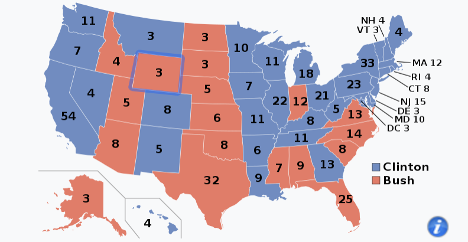

## Title of Project
*A Multivariate Analysis on U.S Presidential Election Results from 1992*
## Description
The analysis seen in this repository was the class project for my Multivariate
Statistical Analysis course for my MS in Statistics. Below I break the description of this project down into two parts (1) a description of the data and (2) the analysis of the data.

#### Data
The demographic data for the counties in 1992 were from [Larry Winner's website](http://users.stat.ufl.edu/~winner/datasets.html), specifically, the [U.S. County Vote for Clinton 1992 & Demographics](http://users.stat.ufl.edu/~winner/data/clinton1.dat) dataset. The remainder of the data was webscraped from  Wikipedia. An example webpage that was scraped can be seen [here](https://en.wikipedia.org/wiki/1992_United_States_presidential_election_in_Georgia). I needed to scrape the data since I needed the percentage of a particular county that voted for Bush in order to determine who won that county in the election. As always, there were independent candidates running along with the two partisan candidates, so you cannot determine who won a county based off if Clinton won 50% or more of a county's vote or not.

The two goals of this project were:

1. Provide statistical inference on the census information to *detect differences
in counties that voted for former president Bill Clinton and former president
George H. W. Bush*. I did so by performing the following:

   - Large sample simultaneous confidence intervals on the demographic variables.

   - Conduct a MANOVA to detect differences in demographic variables based on
   if said counties were won by Clinton or Bush.

   - Perform principle components analysis (PCA) to find variables or linear combinations thereof that explained a significant proportion of the variance in the data.

2. Establish a baseline machine-learning (ML) or statistical model to predict
whether a state county was won by Clinton or Bush based off of demographic data from 1992 *only*. The metric I chose to measure the performance of the models was the *apparent error rate* (APER). Models that were fit and tested on the data were:

   - K-Nearest Neighbors
   - Random Forest
   - Deep learning Neural Network

## Important Files

#### Datasets

   - The final dataset that I constructed is entitled *full_dataset.csv* and provides the combined data from [Larry Winner's website](http://users.stat.ufl.edu/~winner/datasets.html) as well as the webscraped data.

   - The webscraped dataset from Wikipedia is called *web_scraped_table.csv*.

#### Scripts
   - *analysis_script.R* is the script where I performed all of the analysis on *full_dataset.csv*. Everything from EDA visualizations to fitting the models can be found here.

   - *web_scraped_wikipedia.R* is where I scrape the data from Wikipedia.

   - *dataset_merge_script.R* is where I merge the data from Larry Winner's website and the webscraped data.

#### Reports/Presentations
   - *final_report.R* is the final report I turned in - I'm aware of a few typos. At some point I would like to fix these. If there are any questions, feel free to reach out to me.

   - *final_presentation_multi_vars.pptx/pdf* are the files I used to present my findings to the class for this project.

   - All of the visualizations found in this analysis can be found in the folder/directory called *visualizations*. I really like making visualizations, so if you have any feedback/suggestions I am always open to those to expand my skills.

## Acknowledgments

   - Larry Winner for his compilation of the demographic data.

   - Tidyverse (especially dplyr and rvest)

   - Wikipedia

## Project Status

Temporarily completed - I hope to return to this one day and utilize 20 or so years of data to take into account the temporal nature of the data.

## License (MIT)

